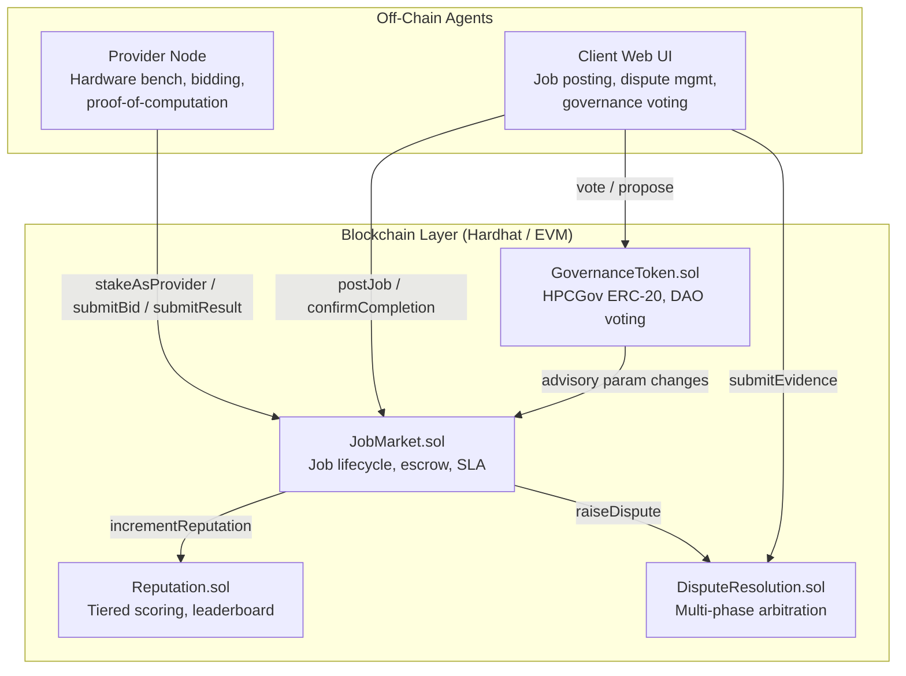
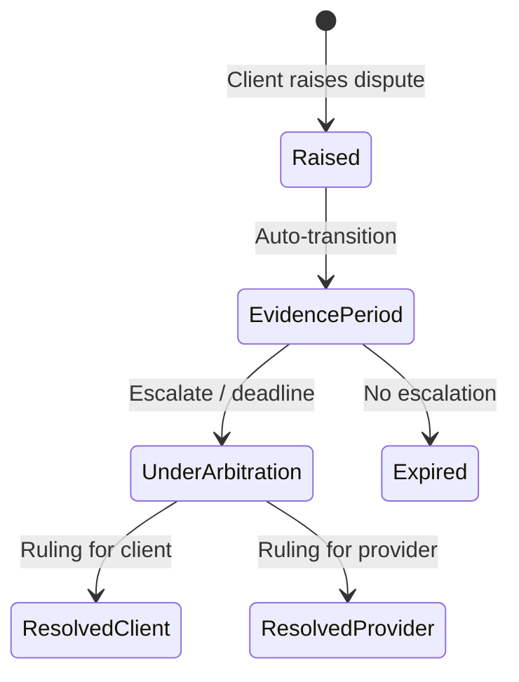
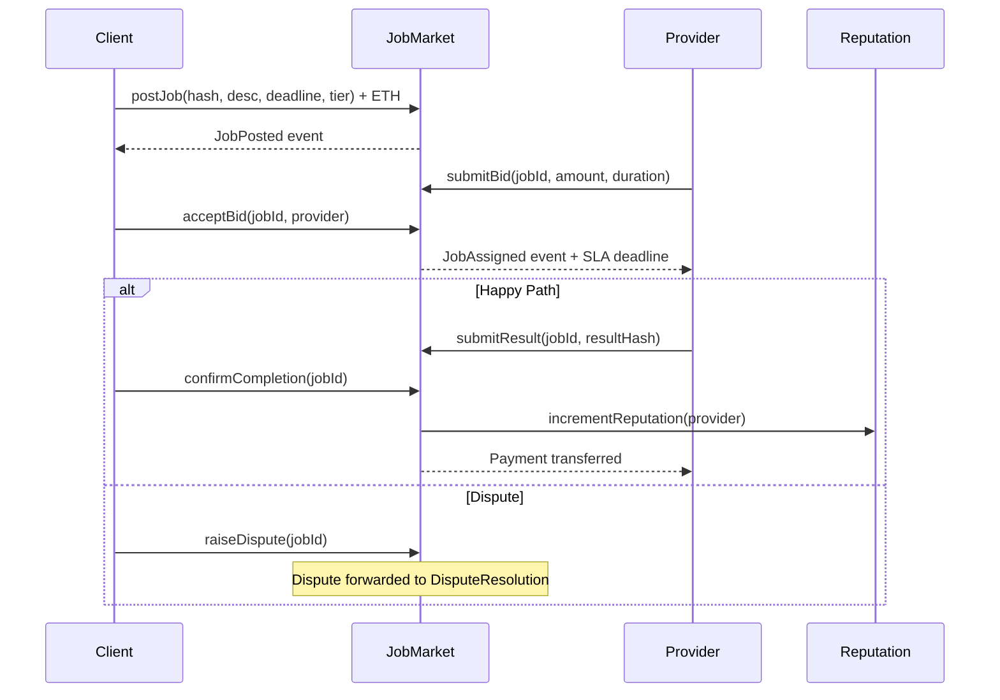
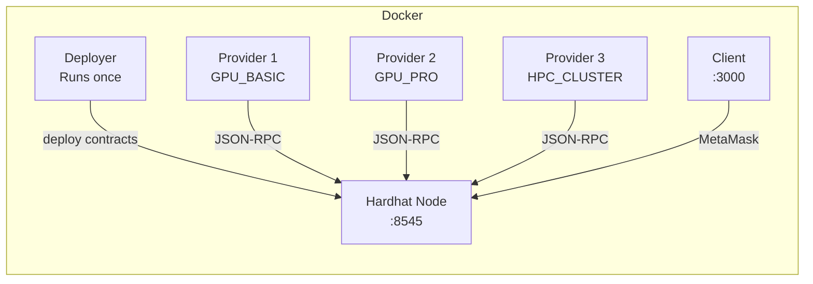

# Architecture — Decentralized HPC Marketplace

> A simulation architectural design for a blockchain-based compute marketplace using mechanism design, DAO governance, and reputation systems to coordinate trustless high-performance computing at a prototype scale.

---

## System Architecture



---

## Smart Contract Architecture

### JobMarket.sol — Core Marketplace

| Aspect | Detail |
|--------|--------|
| **Escrow** | Client deposits ETH on `postJob()`; held until `confirmCompletion()` or dispute resolution |
| **Compute Tiers** | `CPU_STANDARD`, `GPU_BASIC`, `GPU_PRO`, `HPC_CLUSTER` — enforced during bidding |
| **SLA** | Time-locked deadlines set on assignment; `reportSLAViolation()` triggers penalties |
| **Reentrancy** | OpenZeppelin `ReentrancyGuard` on all ETH-transfer functions |
| **Platform Fee** | Configurable fee (default 2%) deducted on payment release |

### Reputation.sol — Provider Trust

| Aspect | Detail |
|--------|--------|
| **Scoring** | Weighted points: base + epoch freshness bonus + streak multiplier |
| **Tiers** | Unranked → Bronze (50) → Silver (150) → Gold (300) → Platinum (500) |
| **Sybil Resistance** | Stake-weighted reputation (`stakeWeight = min(stake / 1 ETH, 3)`) |
| **Leaderboard** | Bounded on-chain leaderboard (max 50 providers) for discovery |

### DisputeResolution.sol — Arbitration Protocol



| Phase | Duration | Actions |
|-------|----------|---------|
| Evidence | 48h | Both parties submit IPFS evidence hashes |
| Arbitration | 72h | Owner-controlled ruling (prototype); DAO arbitration panel (roadmap) |
| Resolution | Immediate | Stake slashing (20%), fund redistribution |

### GovernanceToken.sol — DAO Governance

| Aspect | Detail |
|--------|--------|
| **Token** | ERC-20 "HPCGov" with weighted voting |
| **Proposals** | Requires 100 HPCGov minimum; 3-day voting period |
| **Quorum** | 1,000 HPCGov minimum total votes |
| **Execution** | Advisory (event-based); 24h time-lock after passing |

---

## Data Flow — Job Lifecycle



---

## Provider Node Architecture

```
┌─────────────────────────────────────────┐
│           ComputeProviderNode           │
├─────────────┬───────────┬───────────────┤
│  Benchmark  │  Bidding  │   Execution   │
│  (Simulated │  Engine   │   Pipeline    │
│   HW stats) │  (Cost-   │  (4-phase:    │
│             │   aware)  │   ingest →    │
│             │           │   preproc →   │
│             │           │   compute →   │
│             │           │   package)    │
├─────────────┴───────────┴───────────────┤
│  Heartbeat (30s) │ PoC Hash Chain       │
│  Structured Log  │ Event Subscriptions  │
└─────────────────────────────────────────┘
```

**Key capabilities:**
- **Hardware Benchmarking** — Simulated CPU, GPU, RAM, disk, network metrics
- **Resource-Aware Bidding** — Cost model: `bid = baseCost × utilizationMultiplier`, capped at 95% of budget
- **Proof-of-Computation** — SHA-256 hash chain (100 iterations) as verifiable execution stub
- **Heartbeat** — 30-second liveness reporting with balance, stake, and reputation

---

## Client Frontend Architecture

| View | Purpose |
|------|---------|
| **Dashboard** | Open jobs table, metrics (total, completed, volume, providers) |
| **Create Job** | Form with tier selection, budget, deadline, IPFS hash |
| **My Jobs** | Filtered view of user's jobs (as client or provider) |
| **Nodes & Leaderboard** | Canvas network topology, ranked provider stats |
| **Disputes** | Timeline visualization, evidence submission, arbitration status |
| **Governance** | Proposals list, vote bars, token balance, voting interface |

---

## Security Model

| Threat | Mitigation |
|--------|-----------|
| Reentrancy | OpenZeppelin `ReentrancyGuard` + checks-effects-interactions |
| Sybil attacks | Stake-weighted reputation; minimum stake for participation |
| Front-running | SLA deadlines limit gaming window |
| Operator abuse | Governance token for parameter changes; time-locked execution |
| Malicious providers | Dispute resolution with stake slashing |

---

## Deployment Topology



---

## Technology Stack

| Layer | Technology |
|-------|-----------|
| Smart Contracts | Solidity ^0.8.20, OpenZeppelin 5.0.0 |
| Development | Hardhat, Hardhat Toolbox, Chai |
| Provider Agent | Node.js, ethers.js v6 |
| Client UI | Vanilla HTML/CSS/JS, ethers.js v6 (CDN) |
| Containerization | Docker Compose (5 services) |
| Data Integrity | IPFS CID references (stub) |
