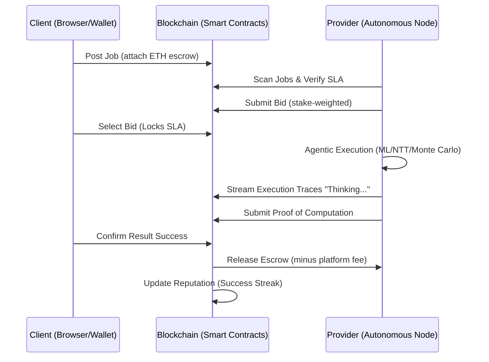

# Decentralized HPC Marketplace (TRL 5 Prototype)

A high-fidelity, blockchain-powered marketplace for High-Performance Computing (HPC) resources. This system enables trustless resource allocation through smart-contract escrow, verified by autonomous provider nodes with live agentic execution traces.

[](https://soliditylang.org/)
[](https://hardhat.org/)
[](https://en.wikipedia.org/wiki/Technology_readiness_level)
[](LICENSE)

---

## 🚀 TRL 5 High-Fidelity Demonstration

> [!IMPORTANT]
> For the complete panel presentation guide, including account setup and live execution steps, see the **[DEMO README](DEMO_README.md)**.

This project has achieved **Technology Readiness Level (TRL) 5**, meaning the technology has been validated in a relevant environment. It demonstrates an end-to-end decentralized compute workflow involving realistic workloads, financial settlement, and multi-user interaction.

### 🎥 System Workflow



---

## 💎 Core Innovation Pillars

### 1. Agentic Execution Traceability
Unlike static compute jobs, our provider nodes utilize an **LLM-style thinking trace**. During execution, nodes stream live status updates (e.g., "Initializing NTT coefficients...", "Optimizing NTT NTT butterfly loops...") to the blockchain, providing clients with unparalleled visibility into the "thought process" of the decentralized compute node.

### 2. Multi-Account Escrow Model
We utilize a robust escrow system where client funds are locked in the `JobMarket.sol` contract upon job creation. Funds are only released to providers upon successful verification of the computation, ensuring 100% financial security for both parties.

### 3. Comprehensive HPC Workload Templates
The system includes pre-configured, real-world Python templates for various HPC domains:
- **Machine Learning**: K-Means Clustering on synthetic datasets.
- **Post-Quantum Cryptography (PQC)**: Superposition NTT (Number Theoretic Transform) optimizations.
- **Scientific Computing**: Monte Carlo simulations for risk assessment.
- **Data Engineering**: Large-scale data transformation and filtering.

---

## 🛠️ Quick Start: Running the TRL 5 Demo

The fastest way to witness the marketplace in action is via the automated launch script.

### Prerequisites
- [MetaMask](https://metamask.io/) installed in your browser.
- [Node.js](https://nodejs.org/) (v16+) and [Python](https://www.python.org/) installed.

### Start the High-Fidelity Demo
Run the provided PowerShell script to launch the entire environment (Blockchain, Provider, and UI) simultaneously:

```powershell
./launch-demo.ps1
```

*This script will:*
1. Start a local **Hardhat Blockchain Node**.
2. Deploy the **Smart Contract Suite** (Marketplace, Reputation, Governance, Disputes).
3. Spin up an **Autonomous Provider Node**.
4. Open the **Glassmorphism Web Dashboard** at `http://localhost:8080`.

---

## 🏗️ Technical Architecture

### Smart Contract Suite
- **`JobMarket.sol`**: Manages the job lifecycle, escrow logic, and bid selection.
- **`Reputation.sol`**: Implements a tiered reward system with success streaks and leaderboard logic.
- **`DisputeResolution.sol`**: Multi-phase arbitration with evidence submission and arbitrator escalation.
- **`GovernanceToken.sol`**: ERC-20 token (`HPCGov`) for DAO-based parameter adjustments.

### Technology Stack
- **Layer 1 (Trust)**: Solidity 0.8.20, OpenZeppelin.
- **Execution (Provider)**: Node.js with Python subprocess integration for HPC jobs.
- **UI/UX**: HTML5, Vanilla CSS (Premium Glassmorphism), Ethers.js v6.
- **Visualization**: D3.js and Mermaid for network and execution traces.

---

## 📈 Technical Roadmap

Moving from TRL 5 to TRL 9 (Full Deployment):

- [ ] **TRL 6**: Cross-chain support (Polygon/Arbitrum) for lower gas costs.
- [ ] **TRL 7**: Zero-Knowledge (zk-SNARKs) based Proof-of-Computation for privacy-preserving jobs.
- [ ] **TRL 8**: Dynamic GPU/TPU resource partitioning and multi-node parallelization.
- [ ] **TRL 9**: Mainnet deployment with decentralized storage (IPFS/Filecoin) for job data.

---

## 📜 License
This project is licensed under the MIT License - see the [LICENSE](LICENSE) file for details.
